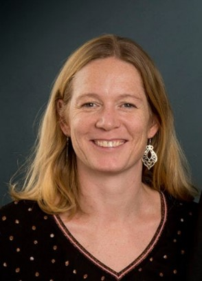

<link rel="stylesheet" href="./assets/css/custom.css">

  

   
  

  <!--
  

    Sustira
  

  -->
  

    <a href="#kurser" class="topbar-link">Workshops</a>
    <a href="#referencer" class="topbar-link">Referencer</a>
    <a href="#kontakt" class="topbar-link">Kontakt</a>
  

<!-- 

  
Sustira

  
CO₂, ESG og cirkulær økonomi – i praksis

-->
### Data. Retning. Forankring 🌿

Hos Sustira hjælper vi jer med at omsætte grønne ambitioner til handling. Vi arbejder med ESG, cirkulær økonomi og CO₂-beregninger – og bygger bro mellem data, strategi og mennesker. Det handler ikke kun om at måle og dokumentere – men om at skabe forandringer, der giver mening for både forretningen og planeten.

For os handler bæredygtighed ikke om flotte ord, men om løsninger, der er rodfæstede i virkeligheden – og som bygger på viden, data og samarbejde..

Vi tror på, at bæredygtighed skal integreres i kerneforretningen – og at det bedst sker, når løsningerne tager afsæt i virkeligheden. Derfor arbejder vi altid med jordforbindelse – både i tilgang, sprog og metode.
---
## 

  

  

 
    
Jeg hedder Mie Kristensen og driver Sustira med ønsket om at gøre bæredygtighed til noget, man kan arbejde med – ikke bare tale om.

    
Min baggrund kombinerer naturvidenskabelig faglighed, undervisningserfaring og praksisnær rådgivning. Jeg hjælper små og mellemstore virksomheder med at forstå og bruge deres CO₂-data, udvikle cirkulære løsninger, forankre ESG-strukturer og skabe strategier, der både er realistiske og ambitiøse.

    
Jeg arbejder med virksomheder, der gerne vil i gang – eller videre – uden at miste jordforbindelsen. Det betyder, at jeg altid tilpasser løsninger til virksomhedens ressourcer, branche og kultur. Jeg faciliterer, oversætter og skubber på, indtil arbejdet med bæredygtighed bliver en integreret del af jeres hverdag.

    
Mit mål er at løfte jeres viden og kompetencer, så I selv kan arbejde videre – og tage ejerskab over den bæredygtige udvikling i jeres forretning.

    Sustira er sammensat af det latinske ord “sustinere” – at understøtte, bære og fastholde – og “æra”, som signalerer en ny tid. Navnet afspejler vores tilgang: at skabe bæredygtige løsninger med retning, balance og forankring.
  

---

##  Workshops

### Fra data til handling – sådan bruger I jeres CO₂-regnskab
🎯 Formål:
At give deltagerne praktiske kompetencer til at forstå, udarbejde og – vigtigst – bruge klimaregnskabet som et styringsværktøj i virksomheden.

👥 Målgruppe:	SMV’er med ingen, begrænset eller begyndende erfaring med CO₂-kortlægning

🧠 Læringsmål

- Forstå forskellen på Scope 1, 2 og 3
- Bruge Klimakompasset og/eller eget regneark som værktøj
- Identificere og strukturere relevante data
- Udlede konkrete reduktionsmuligheder og prioritere dem
- Kommunikere CO₂-resultater internt og eksternt

📅 Varighed: 1-dags workshop eller 2 halve dage (fx kl. 9–12 begge dage)
Mulighed for tilkøb af opfølgende sparring

---
### ESG i SMV – overblik, indsigt og handling
🎯Formål:
At opbygge forståelse for ESG som styringsværktøj og gøre virksomheden i stand til at arbejde struktureret med væsentlighed, KPI’er og organisering.

👥 Målgruppe:	Virksomheder der skal i gang med eller styrke ESG-arbejdet

🧠 Læringsmål
- Forstå ESG-rammens struktur og indhold
- Betydningen af E, S og G
- Identificere væsentlige ESG-emner for virksomheden
- Opbygge datagrundlag og KPI’er
- Lave plan for forankring i organisationen
 
📅 Varighed: 1-dags workshop eller 2 halve dage (fx kl. 9–12 begge dage)
Mulighed for tilkøb af opfølgende sparring

---
### DM hva'fornoget -Et praktisk kursus i dobbeltvæsentlighedsanalyse
🎯 Formål:
At give deltagerne kompetencer til at forstå og arbejde med dobbeltvæsentlighed i deres virksomhed – så det bliver et aktivt og værdiskabende værktøj, ikke bare rapportering. I lærer at bruge analysen som et redskab i både ESG-rapportering og strategisk udvikling – og får konkrete værktøjer, så I selv kan arbejde videre efter kurset.

👥 Målgruppe
- Ejere, direktører og nøglemedarbejdere i små og mellemstore virksomheder
- Virksomheder, der møder krav om ESG-rapportering
- Organisationer, der vil styrke deres strategiske overblik og dokumentation

🧠 Læringsmål
- Forstå, hvad dobbeltvæsentlighed betyder i praksis
- Skelne mellem virksomhedens påvirkning og de finansielle risici og muligheder
- Kortlægge og prioritere de ESG-temaer, der er relevante for netop deres virksomhed
- Bruge analysen som grundlag for både rapportering og strategisk handling
- Styrke samarbejdet og ejerskabet internt i organisationen

📅 Varighed
1 dag eller 2 halve dage
Mulighed for tilkøb af opfølgende sparring eller coaching

---

## Referencer
<blockquote>
  
"Det har været en fornøjelse at have Mie ombord hos Scan Underlay  hvor hun stod i spidsen for  implementeringen af vores ESG- og miljøstrategi. Med en sjælden evne til hurtigt at gennemskue komplekse problemstillinger leverede hun præcise konkrete resultater.

Som sparringspartner bidrog Mie med værdifuld indsigt, konstruktiv feedback og håndfaste anbefalinger inden for alt fra miljørapportering til optimering af bæredygtighedstiltag. Hendes analytiske tankegang, kombineret med en meget konkret og effektiv arbejdsstil, sikrede, at vi nåede Hurtig i mål med vores ESG. end vi havde troet muligt.

Mie skaber desuden et tillidsfuldt samarbejdsklima, hvor alle føler sig motiverede og klædt på til at bidrage. Jeg kan på det varmeste anbefale hende til enhver organisation, der ønsker en dedikeret, hurtigopfattende og resultatorienteret leder inden for ESG og miljø."

  <footer>– Carsten Andersen, CEO ved Scan Underlay</footer>
</blockquote>

<blockquote>
"Jeg kan varmt anbefale Mie Ljungberg Kristensen.
Hun er en engageret og dygtig uddannelseskonsulent, der formår at møde deltagerne i øjenhøjde, forstå deres behov og støtte dem i deres faglige udvikling.
Jeg har haft fornøjelsen af at arbejde sammen med Mie i forbindelse med kompetenceudvikling hos Engineer the Future. Her har hun spillet en central rolle i et udviklingsforløb, der veksler mellem teoretiske workshops og afprøvning i deltagernes egen praksis – herunder udvikling af deres eget undervisningsmateriale.
Mie har med stor indsigt og erfaring støttet deltagerne i alle faser af processen og trukket på sin solide baggrund inden for undervisning og formidling. Samtidig er hun en innovativ og stærk sparringspartner i udviklingen af nye koncepter og undervisningsmaterialer.
Kort sagt: Mie leverer både høj faglighed, nærvær og nytænkning."
  <footer>– Julie Lindholm, projektleder ved Engineer The Furure</footer>
</blockquote>

---

## Kontakt 
Har du spørgsmål, idéer eller brug for en uforpligtende snak om bæredygtighed, cirkulær økonomi eller ESG?
Skriv til mig, og lad os tage en dialog om mulighederne.

  
  <a href="mailto:info@sustira.dk" style="color: #2e8b57; text-decoration: none;">info@sustira.dk</a>

  
  <a href="https://www.linkedin.com/in/dit-linkedin-profil/" target="_blank" style="color: #2e8b57; text-decoration: none;">LinkedIn</a>

Jeg glæder mig til at høre fra dig!

  &nbsp; ✉️ info@Sustira.dk | &nbsp; Sustira er en del af WelcomeSecurity | &nbsp; CVR DK36622652

